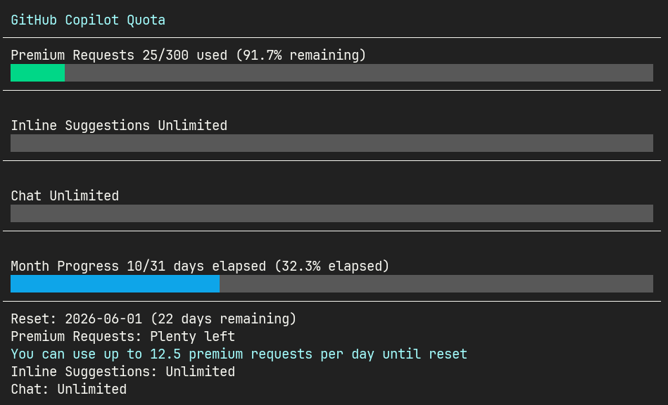

# cpm

A TUI tool that compares your remaining GitHub Copilot Premium requests against the days left in the billing cycle.

> [!WARNING]
> This tool uses GitHub Copilot's internal API, which is unofficial and not intended for external use.
> It may break without notice if GitHub changes their API.
> Use at your own risk.



## Installation

### cargo

```bash
cargo install --git https://github.com/tknkaa/cpm
```

## Usage

```bash
# Fetch quota automatically via GitHub API
cpm

# Choose a display style
cpm --style progress  # default
cpm --style text

# Skip API fetch and specify remaining percentage directly
cpm --premium 23.4
```

Press any key to exit.

## How it works

`gh auth token` is used to retrieve your GitHub OAuth token, which is then used to call the GitHub API and fetch your current quota snapshot. If the API call fails, cpm falls back to a TUI prompt where you can enter the remaining percentage manually (visible in your GitHub billing settings).

## Requirements

- [GitHub CLI](https://cli.github.com/) (`gh`) — for authentication
- A GitHub account with Copilot enabled

## License

MIT
